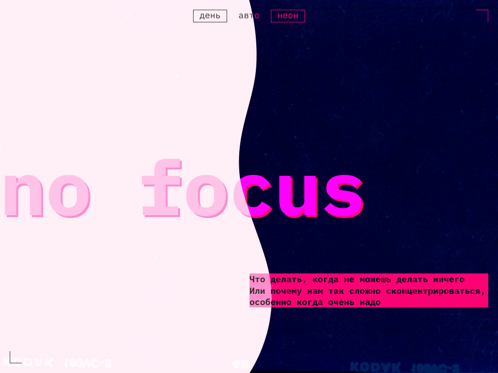

# Проектная работа "Сложно сосредоточиться"
Проект выполнен в рамках 3 спринта - Адаптивность и графика, учебного курса "Фронтенд разработчик" Яндекс.Практикума

## Цель проекта
Сверстать адаптивный сайт в светлой и тёмной темах, а также настроить автоматическое переключение между ними в зависимости от системных настроек пользователя

## Технологии
* HTML
* CSS
* JavaScript

## Особенности:
1. Цветовые темы переключается кнопками в шапке сайта
2. Резиновая верстка для экранов с шириной от: 375px, 768px и 1024px

## Автор
- Github - [Oleg Kashkov](git@github.com:OlegKashkov/slozhno-sosredotochitsya-fd.git)